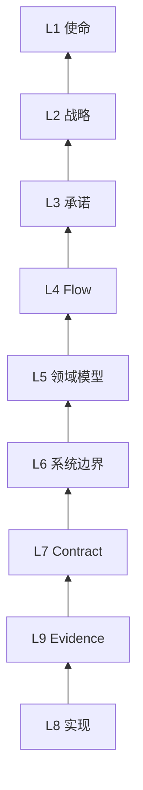

## 第 15 章：SSOT 九层金字塔模型

> 九层金字塔是一套强制阅读和强制更新模型：阅读必须自顶向下，更新必须自底向上。

> 完整公开版（含图）：[如何构造 SSOT 九层金字塔模型：一套可复用的 SSOT 原则](https://liminge.space/cn/blog/nine-layer-pyramid-principles)。

SSOT 如果只是一句口号，很快就会失效。团队需要一套结构，告诉每个人和 AI：事实属于哪一层、影响哪些层、由什么 evidence 证明。

SSOT 九层金字塔模型就是这样一套结构。

### 1. 根目标

金字塔不是目录模板，而是业务、产品、技术事实的最新快照。

它回答：

- 产品为什么存在？
- 当前阶段优先赢什么？
- 团队承诺了什么？
- 真实任务如何完成？
- 哪些概念和不变量是稳定的？
- 系统边界在哪里？
- 哪些 contract 是可执行的？
- 系统如何实现？
- 什么 evidence 能证明这些事实？

### 2. 九层定义

| 层级 | 问题 | 典型 SSOT |
| :--- | :--- | :--- |
| L1 使命 | 产品为什么存在？ | 使命和长期产品身份 |
| L2 战略 | 当前阶段优先赢什么？ | 当前优先级和资源选择 |
| L3 承诺 | 什么是已支持、可依赖的？ | 对外承诺、支持边界、发布声明 |
| L4 Flow | 所有利益相关方如何完成真实任务？ | 用户、AI agent、operator、产品、研发、support、发布流程 |
| L5 领域模型 | 哪些概念和不变量稳定？ | 领域对象、状态、权限、计费规则 |
| L6 系统边界 | 组件和外部服务如何分工？ | 边界图、调用方向、职责归属 |
| L7 Contract | 哪些可执行合同存在？ | API、数据库、环境变量、权限、发布合同 |
| L8 实现 | 系统如何落地？ | 代码、脚本、迁移、配置、自动化 |
| L9 Evidence | 什么证明前八层成立？ | 测试、日志、状态检查、release evidence、线上事实 |

### 3. 阅读必须自顶向下

理解一个问题时，不要从附近的代码开始。

先从顶层开始：

1. 使命
2. 战略
3. 承诺
4. Flow
5. 领域模型
6. 系统边界
7. Contract
8. 实现
9. Evidence

这可以防止一个局部资产反向定义整个产品。

页面还在，不代表它仍然是当前战略。接口还在，不代表它仍然是公开承诺。测试还在跑，不代表它仍然保护当前主线。

### 4. 更新必须自底向上

改变系统时，要从底部开始更新：

1. 实现
2. Evidence
3. 如果可执行行为变化，再更新 contract
4. 如果职责或不变量变化，再更新边界和领域模型
5. 如果可依赖能力变化，再更新 Flow 和承诺
6. 只有当资源选择或长期身份变化时，才更新战略和使命

这可以防止一个 POC 过早升级成战略。

它也可以防止战略改变后，旧 contract、旧测试、旧日志和旧对外表达继续滞留。

### 5. Flow 是跨职能工作流层

Flow 不是 UI 页面路径。

它必须囊括所有利益相关方的工作流：

- 用户流程
- AI agent 流程
- 产品流程
- 运营流程
- 研发流程
- support 流程
- 发布流程
- 内部实验流程

对于 AI-Native 系统，这一层尤其关键。AI agent 不是被动用户，它会读文档、选工具、调用能力、生成 artifact、产出 evidence。

如果 Flow 层没有定义 agent 如何工作，agent 就会开始猜。

### 6. 每个专题文档都要声明归属

架构、运维、工作计划、测试、UI、安全、support 文档都可以保留自己的结构。

但每个专题文档必须声明：

- `Layer owner`：事实主要由哪一层拥有
- `Feeds / Affects`：它提供或影响哪些层
- `Stability`：稳定事实、current work、evidence，还是参考资料
- `Exit / Promotion`：临时工作完成后，稳定结论提升到哪里

专题文档本身没有问题。没有归属的专题文档，才会变成竞争性的事实系统。

### 7. Evidence 不是文档

文档可以描述事实，但不能证明事实。

Evidence 包括：

- 测试
- 日志
- 状态命令
- 线上只读检查
- 发布清单
- 审批记录
- release evidence
- 真实 provider 或真实用户路径验收

如果一个公开承诺没有 evidence，它就不是承诺。

### 8. Current work 不能变成永久记忆

临时调查和计划属于 current work。

每个 current-work 项都应该说明：

- 当前打开的问题是什么
- 谁负责
- 下一步关闭动作是什么
- 什么条件下删除或提升

完成后，只把稳定结论提升到对应层。计划本身删除或压缩。

这样长期记忆才能保持 greenfield 和 current-state。

### 9. 最小落地清单

1. 建立九层入口。
2. 建立一个 current-work SSOT。
3. 把“当前优先级”和“核心能力”收敛到一个权威入口。
4. 给专题文档补归属元信息。
5. 定义 evidence 等级：inventory、contract read、static evidence、runtime evidence、release evidence。
6. 收敛测试、发布、运维入口。
7. 让 AI agent 自顶向下阅读。
8. 让 AI agent 自底向上更新。
9. 删除或压缩已完成计划。
10. 语义变化时同步改名。

### 10. 小结

SSOT 九层金字塔模型的存在，是为了让团队默认不发生脑分裂。

它强迫每个阅读者先理解整个产品，再解释局部事实。它也强迫每个产出者先更新实现和 evidence，再判断一个概念是否应该向上提升。

这就是 AI-Native 团队保持一个最新、唯一、可验证事实模型的方式。
