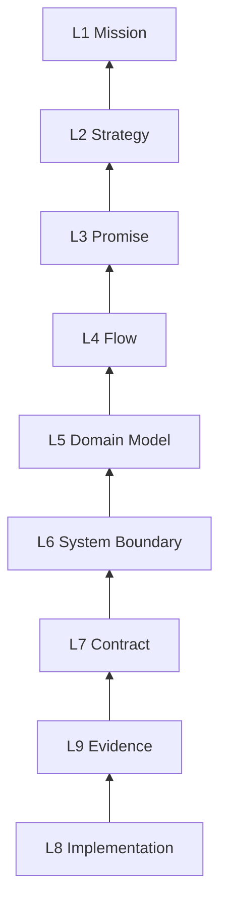

## Chapter 15: The SSOT Nine-Layer Pyramid Model

> The nine-layer pyramid is a forced reading and updating model: read top-down, update bottom-up.

> Full public version with diagrams: [How to Build an SSOT Nine-Layer Pyramid Model](https://liminge.space/blog/nine-layer-pyramid-principles).

SSOT fails when it remains a slogan. A team needs a structure that tells every human and AI reader where a fact belongs, what it affects, and what evidence proves it.

The SSOT Nine-Layer Pyramid is one such structure.

### 1. The Root Goal

The pyramid is not a folder template. It is an up-to-date snapshot of business, product, and engineering truth.

It answers:

- Why does the product exist?
- What must the team win now?
- What has the team promised?
- How do real tasks get done?
- What concepts and invariants are stable?
- Where are system boundaries?
- What contracts are executable?
- How is the system implemented?
- What evidence proves it?

### 2. The Nine Layers

| Layer | Question | Example SSOT |
| :--- | :--- | :--- |
| L1 Mission | Why does the product exist? | Mission and long-term product identity |
| L2 Strategy | What must the team win now? | Current priorities and resource choices |
| L3 Promise | What is supported and dependable? | Public promise, support boundary, release statement |
| L4 Flow | How do stakeholders complete real tasks? | User, AI agent, operator, product, engineering, support, and release flows |
| L5 Domain Model | What concepts and invariants are stable? | Domain objects, states, permissions, billing rules |
| L6 System Boundary | How do components and providers divide responsibility? | Boundary map, call direction, ownership rules |
| L7 Contract | What executable contracts exist? | API, database, environment, permission, release contracts |
| L8 Implementation | How is the system realized? | Code, scripts, migrations, config, automation |
| L9 Evidence | What proves the previous layers? | Tests, logs, status checks, release evidence, production facts |

### 3. Read Top-Down

When understanding a problem, do not start from nearby code.

Start from the top:

1. Mission
2. Strategy
3. Promise
4. Flow
5. Domain model
6. System boundary
7. Contract
8. Implementation
9. Evidence

This prevents one local artifact from redefining the whole product.

A page that still exists is not necessarily current strategy. An API that still exists is not necessarily a public promise. A test that still runs is not necessarily protecting the current mainline.

### 4. Update Bottom-Up

When changing the system, update from the bottom:

1. Implementation
2. Evidence
3. Contract if executable behavior changed
4. Boundary and domain model if ownership or invariants changed
5. Flow and promise if dependable capability changed
6. Strategy and mission only if resource allocation or long-term identity changed

This prevents a POC from being promoted into strategy too early.

It also prevents a strategic shift from leaving old contracts, old tests, old logs, and old public messaging behind.

### 5. Flow Is the Cross-Functional Layer

Flow is not only UI navigation.

It must include every stakeholder workflow:

- user workflow
- AI agent workflow
- product workflow
- operations workflow
- engineering workflow
- support workflow
- release workflow
- internal experiment workflow

For AI-native systems, this layer is critical because AI agents are not passive users. They read documents, select tools, call capabilities, generate artifacts, and produce evidence.

If the Flow layer does not define how agents work, agents will guess.

### 6. Every Specialized Document Needs Ownership

Architecture, operations, working plans, testing, UI, security, and support documents can keep their own structures.

But every specialized document must declare:

- `Layer owner`: which layer owns the fact
- `Feeds / Affects`: which layers it informs or changes
- `Stability`: stable fact, current work, evidence, or reference
- `Exit / Promotion`: where the stable result moves when temporary work is done

Specialized documents are useful. Unowned specialized documents become competing truth systems.

### 7. Evidence Is Not Documentation

Documentation can describe a fact. It does not prove the fact.

Evidence includes:

- tests
- logs
- status commands
- read-only production checks
- release checklists
- approvals
- release evidence
- real provider or real user-path acceptance

If a public promise has no evidence, it is not a promise.

### 8. Current Work Must Not Become Permanent Memory

Temporary investigations and plans belong in current work.

Each current-work item should say:

- what problem is open
- who owns it
- what the next close action is
- what condition deletes or promotes it

When the work is complete, only the stable conclusion moves into the relevant layer. The plan is deleted or compressed.

This keeps long-term memory greenfield and current-state focused.

### 9. Minimal Adoption Checklist

1. Create nine layer entries.
2. Create one current-work SSOT.
3. Move "current priority" and "core capability" statements into one authority.
4. Add ownership metadata to specialized documents.
5. Define evidence levels: inventory, contract read, static evidence, runtime evidence, release evidence.
6. Converge test, release, and operations entry points.
7. Teach AI agents to read top-down.
8. Teach AI agents to update bottom-up.
9. Delete or compress completed plans.
10. Rename concepts when their meaning changes.

### 10. Summary

The SSOT Nine-Layer Pyramid exists to make the team impossible to split-brain by default.

It forces every reader to understand the whole product before interpreting local facts. It forces every producer to update implementation and evidence before promoting a concept upward.

That is how an AI-native team keeps one current, evidence-backed model of truth.
